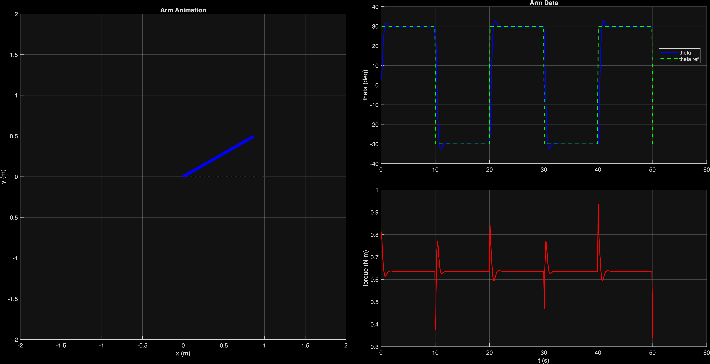
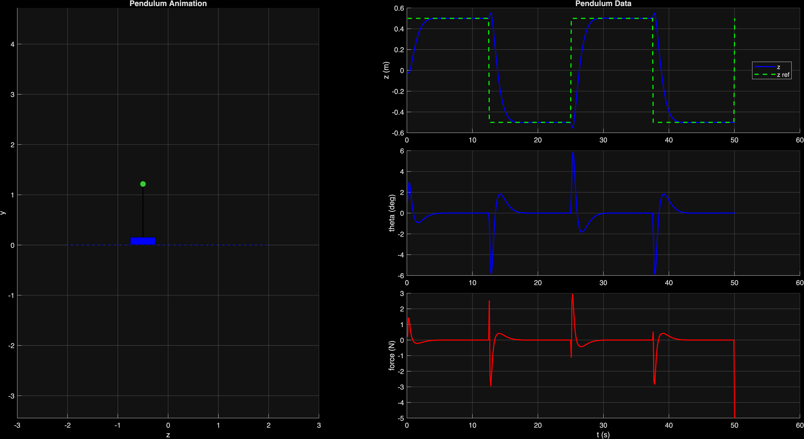
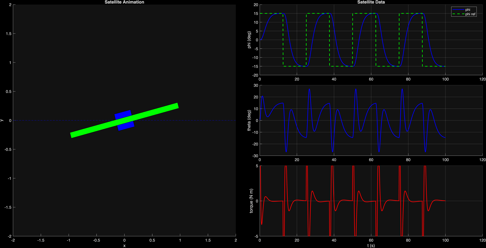
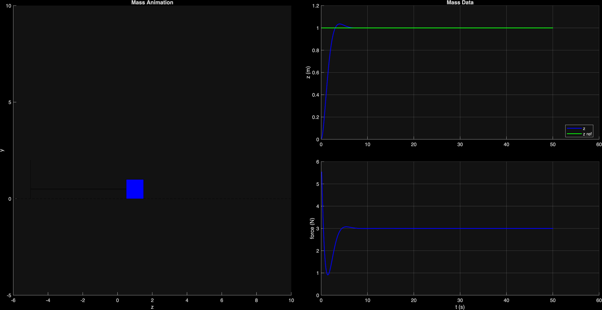
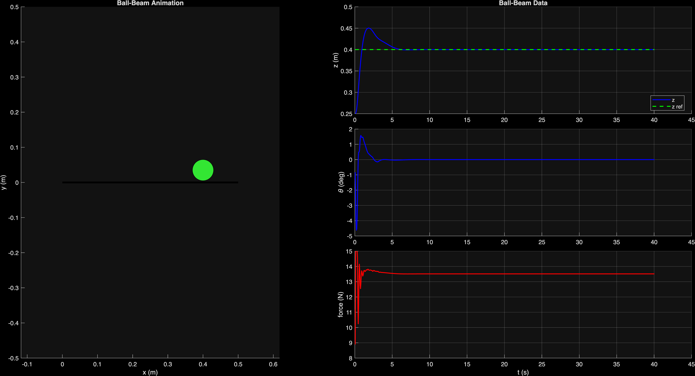
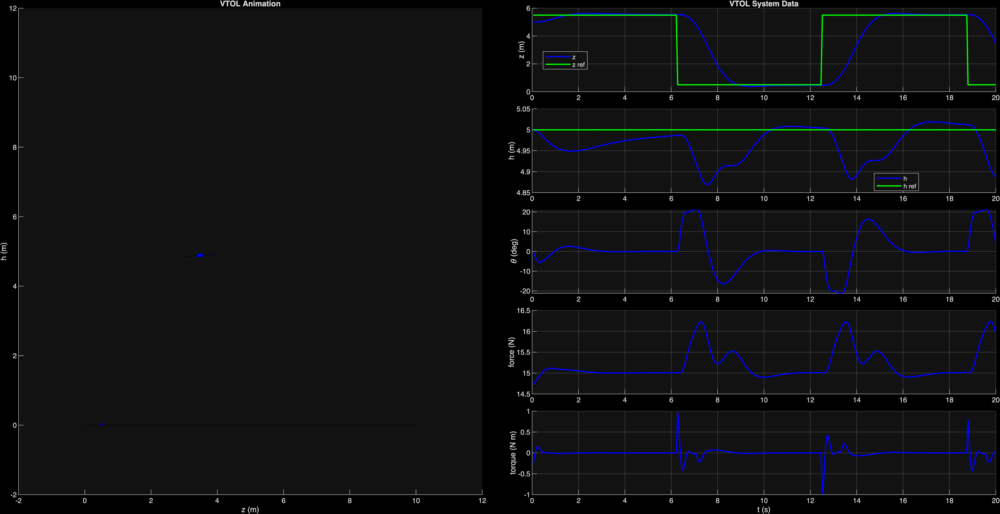

# FeedbackControl

MATLAB implementations of feedback control design studies based on the design study workflow from *Introduction to Feedback Control Using Design Studies* by Randal W. Beard.

This repository collects simulation, modeling, and controller-design scripts for six systems used in introductory feedback-control study:

## A_arm
Single link robot arm

## B_pendulum
Pendulum on a cart

## C_satellite
Satellite attitude control

## D_mass
Mass-spring-damper

## E_ballbeam
Ball-on-beam

## F_vtol
Planar VTOL

